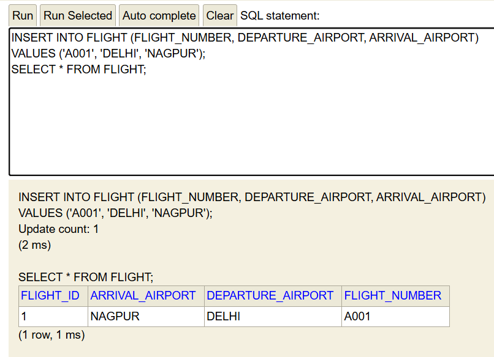
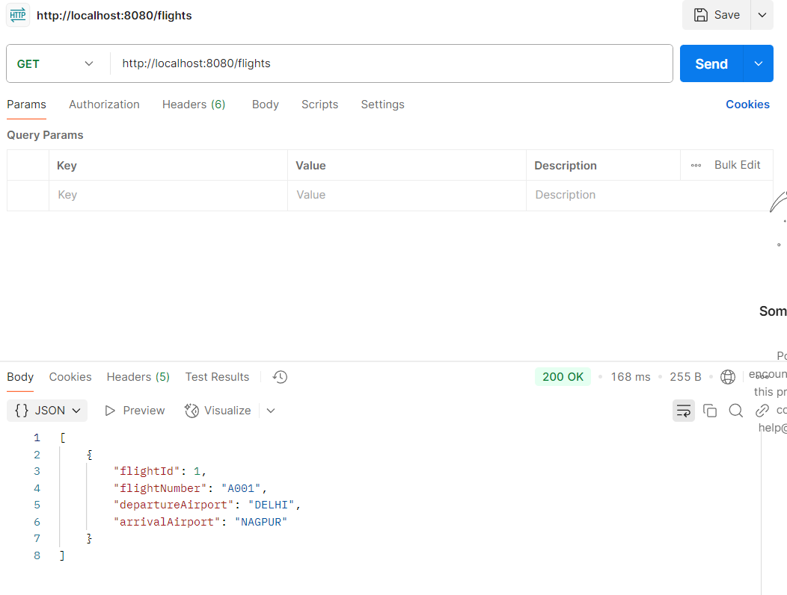
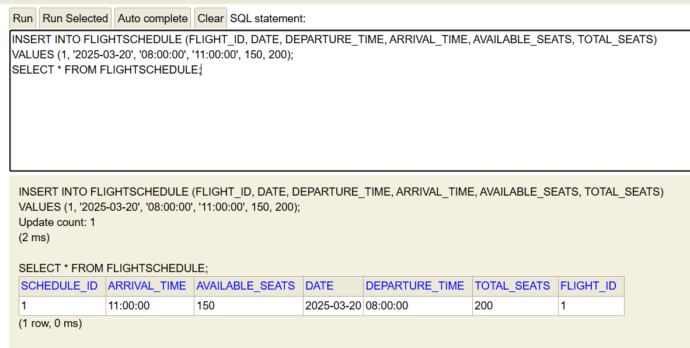
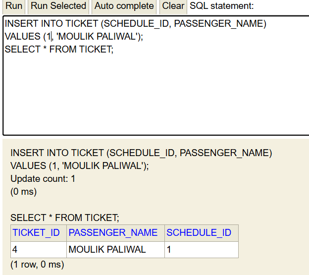
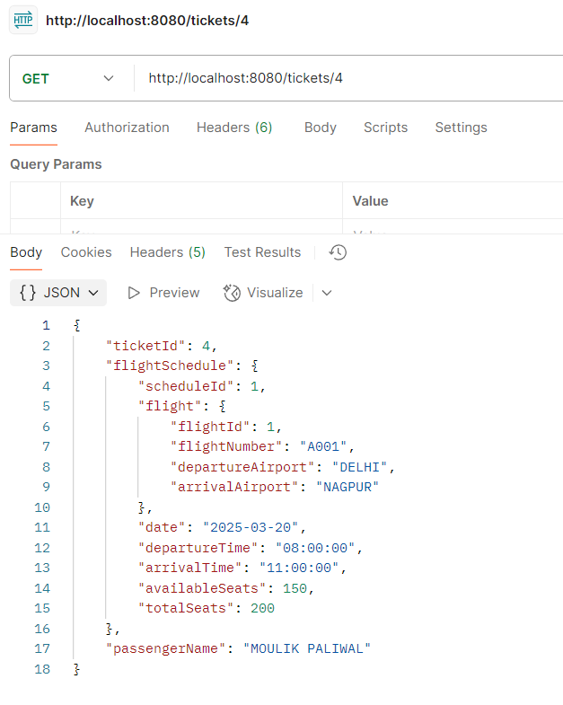

# Airline-Management-System
Airline Management System
This is a Spring Boot application designed to manage airline flight data. It provides RESTful endpoints to retrieve flight information, uses an in-memory H2 database for storage, and allows manual data manipulation via the H2 Console. The project is built with Maven and includes basic CRUD operations for flights.

# Running steps
1) Install all the dependencies.
2) Run 'mvn clean install' to check for any build errors.
3) Run the main application.
4) Access the H2 console by running 'http://localhost:8080/h2-console' in browser and then connect to it.
5) Add data to the tables present in H2 console by running sql queries and give api calls from postman.
## Inserting into flight table

## Inserting into flightschedule table

## Inserting into ticket table

